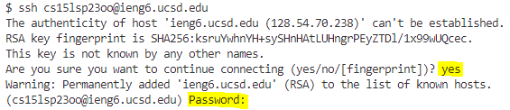
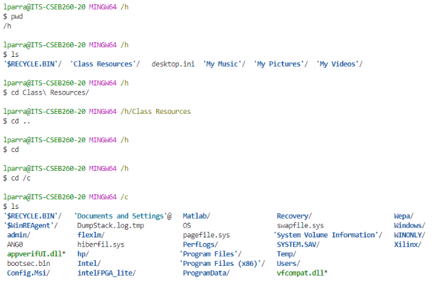

# Lab Report 1 - Remote Access and FileSystem (Week 1)

## Section 1 : Installing VScode (*First Time Setup*)
1. First, if Visual Studio Code is not installed on your device click on the [link](https://code.visualstudio.com/) and follow the directions to install. If you are using a lab computer, like during lab time, Visual Studio is already installed and this step can be skipped.
2. Since git is a neccesary step of using VScode and neccesary to correctly use commands you install git at [this link](https://gitforwindows.org/). From there you click on download and click through all of the installations (You don't need to alter any of the intstallation settings)
3. Next follow these steps during your first time launching Visual Studio (and if Bash isn't running on VScode. *These were the steps given to us during class.* You can skip Step 1 if you had already downloaded git.)
---

## Section 2 : Remotely Connecting
1. To remotely connect you need to be using Bash on VSCode, so if you don't have it installed look at Section 1 steps 2-3.
2. Each new student is given a username to login to, to remote connectly on my end I type in 
` $ ssh cs15lsp23oo@ieng6.ucsd.edu ` into the terminal. ` cs15lsp23oo ` is my account but other new students will have to replace the last two letters with their own username. However, as I was doing my lab, and still now, my password is not working for my account but once it is finished it would ask for your **password** and thats when you would log in. (It might not seem you are typing when inputting your password but you are).
---

Do note that when connecting to the server for the first time you will have to accept the connection by typing `yes` into the terminal. 

## Section 3 : Trying Some Commands on VSCode
1. Now you are able to able to use commands on VSCode (if you have connection issues remotely connecting you can still do these commands.)

These are some examples of me using commands on the Lab Computer.

This is where I was trying to use commands and then changed my directory to the c drive instead from the h drive that's on the lab computers.

Do note that depending on each computer you use this own (due to files differing depending on personal laptops) not all commands will look the same and have the same output. 
